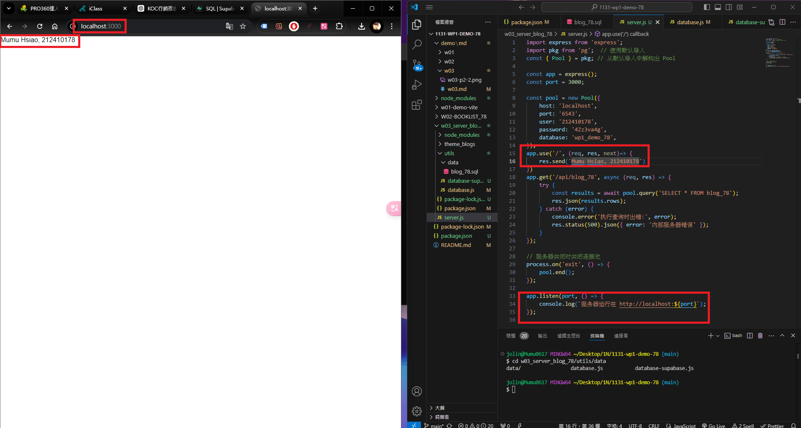
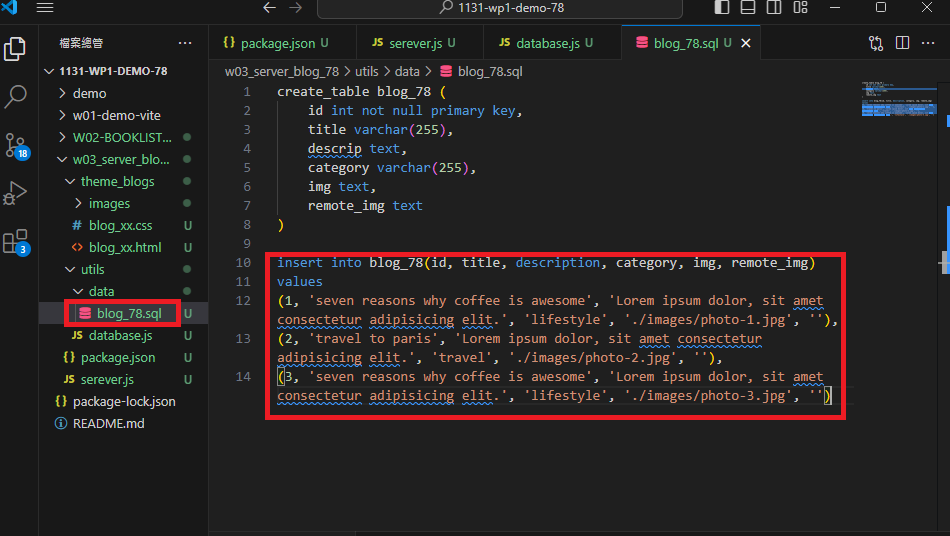
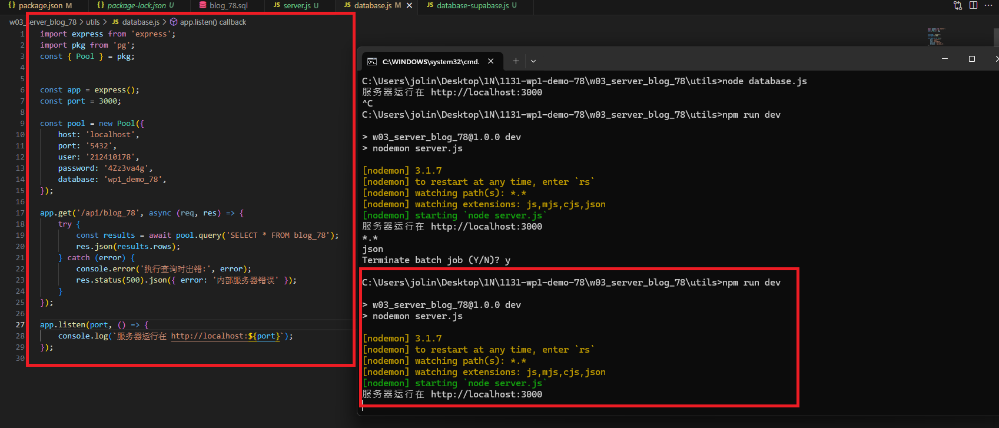
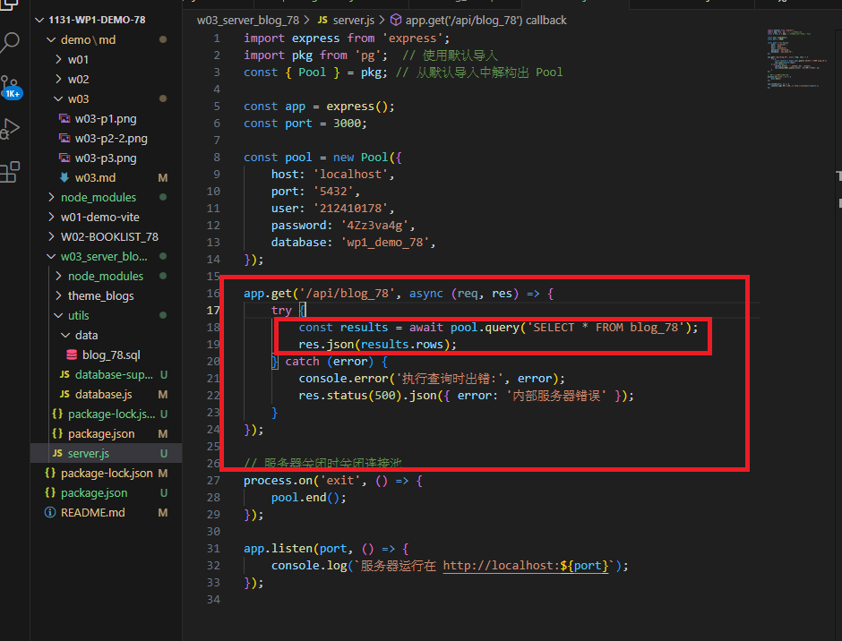
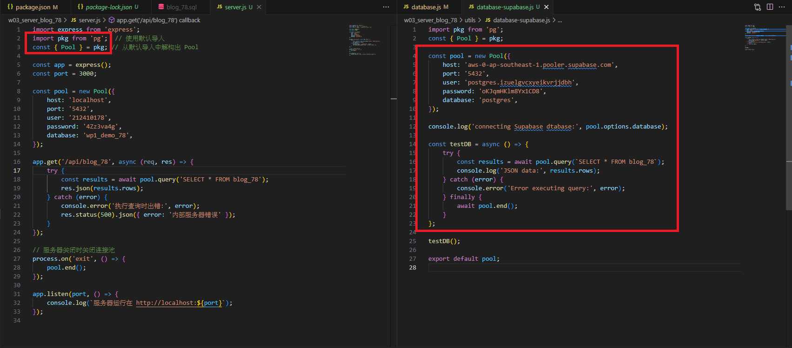
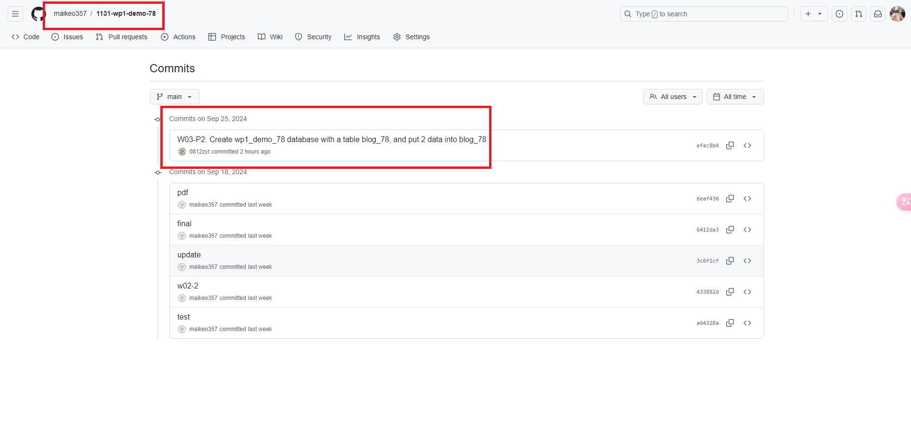

### W03-P1: Create an express Web server and show your name and ID
 

 
```
ea8cfaf htchung Wed Sep 25 18:58:28 2024 +0800  W03-P1: Create an express Web server and show your name and ID
```

### W03-P2: Create wp1_demo_78 database with a table blog_78, and put 2 data into blog_78

#### => pgAdmin


#### => sq1



```
efac8b4 maikeo357       Wed Sep 25 19:39:09 2024 +0800  W03-P2: Create wp1_demo_78 database with a table blog_78, and put 2 data into blog_78
```

### W03-P3: Create database.js to connect blog_xx as in P2 and show 2 data
 

 
```
efac8b4 maikeo357       Wed Sep 25 19:39:09 2024 +0800  W03-P2: Create wp1_demo_78 database with a table blog_78, and put 2 data into blog_78

```

### W03-P4: Using route /api/blog_xx to get json data and show it in the browser


```
efac8b4 maikeo357       Wed Sep 25 19:39:09 2024 +0800  W03-P2: Create wp1_demo_78 database with a table blog_78, and put 2 data into blog_78
```

### W03-P5: Using route /api/blog_xx to get json data from Supabase, and show it in the browser
 

```
efac8b4 maikeo357       Wed Sep 25 19:39:09 2024 +0800  W03-P2: Create wp1_demo_78 database with a table blog_78, and put 2 data into blog_78
```

### W03-P6: all git logs of W3


```
efac8b4 maikeo357       Wed Sep 25 19:39:09 2024 +0800  W03-P2: Create wp1_demo_78 database with a table blog_78, and put 2 data into blog_78
```